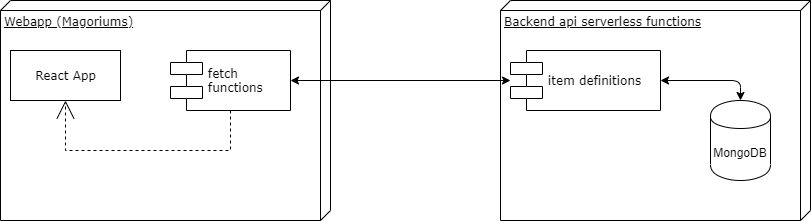

# Magoriums

A Restock admin webapp , to manage:

- Item Definition actions such as:
  - adding
  - listing
  - deleting
  - modifiying

## Highlevel System Setup

## Run in development mode

- `yarn install`
- start a local instance of the functions along with the frontend `BACKEND_HOST=<HOST_NAME> yarn netlify dev`
  - BACKEND_HOST is the host for the actual backend services for example `https://condescending-neumann-62a029.netlify.com`
